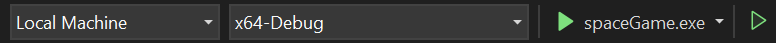
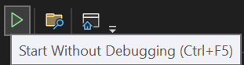

# Space shooter

## Run code
1. Clone this repo
```
git clone https://github.com/2landhnal/SpaceShooter.git
```
2. Open folder in Visual Studio 2022
3. Select debug target

4. Run


## Features
- Endless game
- Using WASD to move
- Left mouse to shoot
- Items: Recovery, random bullet
- Highscore saving

## Pakaged
[Space shooter](https://husteduvn-my.sharepoint.com/:u:/g/personal/nguyen_cb216864_sis_hust_edu_vn/ET9EDQpjsqJFvoaXw_7m0b0BLBGmwDGS0n4YdOHCtWCoHw?e=Jfz4Zo)


## Reference
Refactor code from repo below
[Repo](https://github.com/meemknight/game-in-cpp-full-course)

